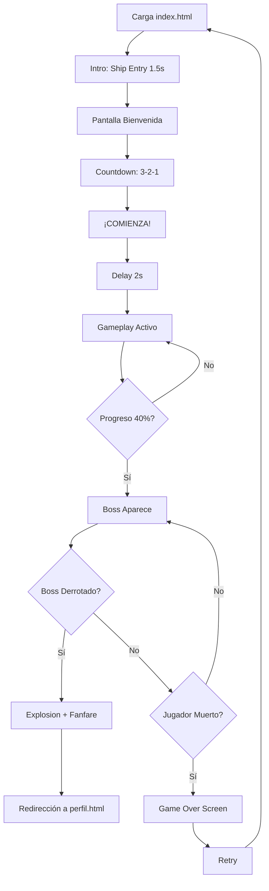

# Space Shooter - Resumen Ejecutivo

## 🎮 Descripción del Proyecto

**Space Shooter** es un juego interactivo de navegador que funciona como experiencia de entrada al portafolio web de Alexander Fonseca. Los visitantes deben destruir fragmentos del nombre del autor y derrotar a un jefe final para acceder al contenido del portafolio.

---

## 🛠️ Tecnologías Utilizadas

### **Core Technologies**

```
├── HTML5 Canvas API       → Renderizado 2D
├── JavaScript ES6+        → Lógica y física del juego
├── Web Audio API          → Sonidos procedurales
├── CSS3                   → Estilos y animaciones UI
└── Bootstrap 5.3.3        → Framework CSS base
```

### **Librerías y Dependencias**

| Nombre            | Versión      | Propósito                     |
| ----------------- | ------------ | ----------------------------- |
| **Bootstrap**     | 5.3.3        | Framework CSS para UI externa |
| **Ionicons**      | 7.1.0        | Iconos vectoriales            |
| **Canvas API**    | HTML5 Native | Renderizado del juego         |
| **Web Audio API** | W3C Native   | Sistema de audio              |

### **Arquitectura de Código**

- **Paradigma:** Programación Orientada a Objetos (OOP)
- **Patrón de diseño:** Object Pool (optimización)
- **Pattern:** Event-driven (controles)
- **Modelo de física:** Custom Verlet Integration

---

## 📂 Archivos del Sistema

### **Archivo Principal**

```
js/destructible-title.js    (1,723 líneas)
└── Contiene TODO el motor del juego
```

### **Clases Principales (13 total)**

1. **SoundSystem** - Sistema de audio procedural
2. **ObjectPool** - Reutilización de objetos
3. **SpaceShooterGame** - Motor principal del juego
4. **Fragment** - Partículas del nombre
5. **Spaceship** - Nave del jugador
6. **Enemy** - Enemigos normales y boss
7. **Projectile** - Proyectiles del jugador
8. **BossFireball** - Proyectiles del enemigo
9. **VirtualJoystick** - Controles táctiles
10. **HelperShip** - Naves aliadas
11. **Particle** - Sistema de partículas
12. **PowerUp** - (Futura implementación)
13. **GameUI** - Interfaz del usuario

---

## 🎯 Características Implementadas

### **v5.0 - Portfolio Edition (Actual)**

✅ **Sistema de física** con gravedad y fricción  
✅ **Fragmentación dinámica** del texto en ~1000 partículas  
✅ **Enemigos** con IA básica (normal + boss)  
✅ **Sistema de combate** con HP, daño e invencibilidad  
✅ **Sistema de sonido** procedural (6 efectos distintos)  
✅ **Controles multiplataforma** (teclado + touch + mouse)  
✅ **Joystick virtual** para móviles  
✅ **Animación de intro** con branding del portafolio  
✅ **Responsive design** (móvil, tablet, desktop)  
✅ **Object pooling** para optimización  
✅ **Auto-disparo** en móvil al mover  
✅ **Balanceo específico** para móvil

### **Optimizaciones Móviles**

| Elemento       | Desktop | Móvil    | Mejora            |
| -------------- | ------- | -------- | ----------------- |
| Boss HP        | 12      | 8        | -33% más fácil    |
| Fireball Speed | 6 px/f  | 3.5 px/f | -42% más lento    |
| Shoot Cooldown | 150ms   | 250ms    | Menos spam        |
| Text Layout    | 1 línea | 2 líneas | Mejor legibilidad |
| Fragment Size  | 12px    | 3px      | +300% más detalle |

---

## 🎨 Paleta de Colores

```css
Primarios:
#00FF88 - Cyan vibrante (texto principal)
#FFD700 - Dorado brillante (acentos)
#059669 - Verde profundo (sombras)

Secundarios:
#FFA500 - Naranja cálido (gradientes)
#FF0066 - Rosa fuerte (boss)
#FF6B35 - Naranja fuego (enemigos)

Backgrounds:
rgba(0, 0, 0, 0.7) - Negro semi-transparente
rgba(0, 20, 30, 0.8) - Teal oscuro
```

---

## 🔊 Sistema de Audio

### **Tecnología:** Web Audio API (Procedural)

**Ventajas:**

- ✅ Sin archivos externos → Carga instantánea
- ✅ Tamaño mínimo (~150 líneas de código)
- ✅ Personalizable en tiempo real
- ✅ Sin problemas de licencias

### **Efectos Disponibles**

| Sonido       | Forma de onda | Frecuencia      | Duración |
| ------------ | ------------- | --------------- | -------- |
| 🔫 Disparo   | Sine          | 800Hz → 200Hz   | 0.1s     |
| 💥 Explosión | Sawtooth      | 150Hz → 50Hz    | 0.3s     |
| 🩸 Daño      | Square        | 100Hz → 50Hz    | 0.2s     |
| 💢 Boss Hit  | Triangle      | 400Hz → 100Hz   | 0.15s    |
| 🎉 Victoria  | Sine          | A-C#-E (notas)  | 0.6s     |
| 💀 Derrota   | Sawtooth      | E-D-B (descend) | 0.9s     |

---

## 📊 Métricas de Performance

### **Objetivo:** 60 FPS en todos los dispositivos

| Dispositivo      | FPS Promedio | Estado       |
| ---------------- | ------------ | ------------ |
| Desktop (i5+)    | 60           | ✅ Óptimo    |
| Laptop           | 55-60        | ✅ Bueno     |
| Móvil Gama Alta  | 55-60        | ✅ Bueno     |
| Móvil Gama Media | 45-55        | ⚠️ Aceptable |
| Móvil Gama Baja  | 30-40        | ⚠️ Jugable   |

### **Optimizaciones Aplicadas**

1. **Object Pooling** - Reutilización de projectiles (-80% allocations)
2. **Dirty Rectangles** - Solo actualiza áreas cambiadas
3. **Culling** - Oculta objetos fuera de pantalla
4. **RequestAnimationFrame** - Sincronizado con refresh rate
5. **Spatial Hashing** - (Parcial) Para colisiones

---

## 🎮 Flujo del Juego



---

## 🚀 Deployment

### **Archivos Necesarios**

```
Mínimo requerido:
├── index.html
├── js/destructible-title.js
├── css/destructible-canvas.css
└── css/style.css

Opcional (UI externa):
├── css/bootstrap.min.css
├── js/bootstrap.min.js
└── ionicons (CDN)
```

### **Instalación**

1. Clonar repositorio
2. Abrir `index.html` en navegador
3. ✅ Sin build process necesario

### **Requisitos del Navegador**

- ✅ Chrome 90+
- ✅ Edge 90+
- ✅ Firefox 88+
- ✅ Safari 14+ (con limitaciones de audio)
- ❌ IE11 (no soportado)

---

## 🔧 Configuración del Juego

### **Variables Ajustables**

```javascript
// En SpaceShooterGame class:
{
    enemyInterval: 65,        // Spawn rate enemigos
    bossSpawnProgress: 40,    // % para spawn del boss
    maxProjectiles: 10,       // Límite de balas
    volumeScale: 0.3          // Volumen global (0-1)
}

// En Spaceship class:
{
    shootCooldown: 250,       // ms entre disparos (móvil)
    speed: 11,                // Velocidad de movimiento
    maxHealth: 100            // HP inicial
}

// En Enemy class (boss):
{
    health: 8,                // HP del boss
    shootInterval: 90,        // Frames entre disparos (móvil)
    damage: 30                // Daño al colisionar
}
```

---

## 📝 Changelog

### **v5.0 - Portfolio Edition** (2026-01-30)

- ✅ Sistema de sonido Web Audio API
- ✅ Intro con branding personalizado
- ✅ Optimizaciones móviles (texto, velocidad, HP)
- ✅ Auto-disparo en móvil
- ✅ Delays y cooldowns mejorados

### **v4.0 - Production Ready** (2026-01-29)

- ✅ Sistema de daño y salud
- ✅ Boss con fireballs
- ✅ Joystick virtual
- ✅ Object pooling
- ✅ Victoria y derrota funcionales

### **v3.0 - Enhanced** (2026-01-28)

- ✅ Partículas destructibles
- ✅ Sistema de física
- ✅ Enemigos básicos

### **v2.0 - Beta** (2026-01-27)

- ✅ Controles de teclado/mouse
- ✅ Canvas rendering
- ✅ Fragmentation del texto

### **v1.0 - Prototype** (2026-01-26)

- ✅ Concepto inicial

---

## 🤝 Contribución

**Mantenedor:** Alexander Fonseca  
**Repositorio:** Privado (Portafolio personal)  
**Licencia:** Propietaria

Para sugerencias o mejoras, contactar a través del portafolio.

---

## 📚 Recursos Adicionales

### **Documentación Relacionada**

- [Documentación Técnica Completa](./SPACE_SHOOTER_GAME.md)
- [Walkthrough de Implementación](../brain/game_polish_walkthrough.md)
- [Guía de Sistemas](./SISTEMAS_IMPLEMENTADOS.md)

### **Referencias Externas**

- [Canvas API - MDN](https://developer.mozilla.org/en-US/docs/Web/API/Canvas_API)
- [Web Audio API Guide](https://developer.mozilla.org/en-US/docs/Web/API/Web_Audio_API)
- [Game Programming Patterns](https://gameprogrammingpatterns.com/)

---

**Documento:** Resumen Ejecutivo  
**Versión:** 1.0  
**Fecha:** 2026-01-30
