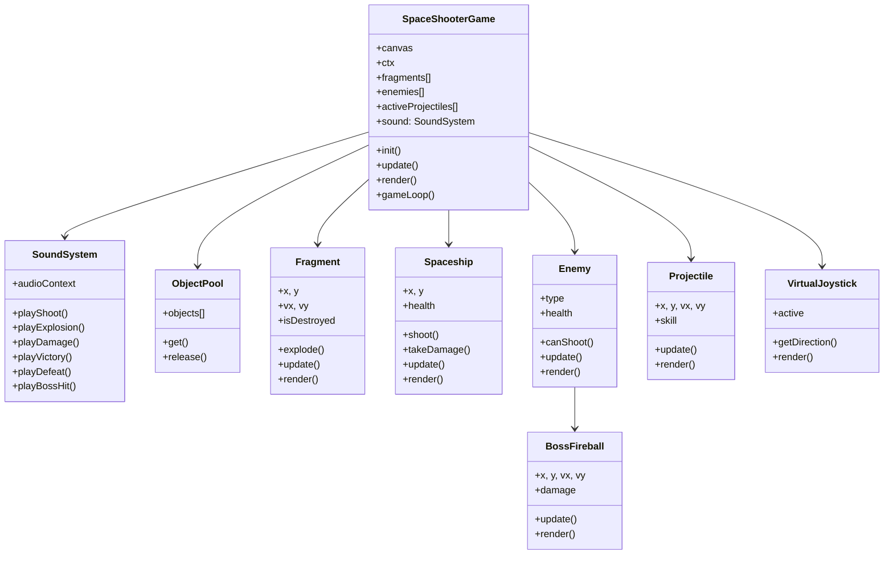

# Space Shooter Game - Documentación Técnica Completa

## 📋 Información General

**Nombre:** Interactive Space Shooter  
**Versión:** v5.0 - Portfolio Edition  
**Tipo:** Juego de navegador HTML5/Canvas  
**Propósito:** Experiencia interactiva de entrada al portafolio de Alexander Fonseca  
**Fecha de creación:** Enero 2025  
**Última actualización:** Enero 30, 2026

---

## 🎯 Descripción

Space Shooter es un juego interactivo de acción/arcade que sirve como pantalla de entrada innovadora para el portafolio. El jugador debe destruir fragmentos del nombre "ALEXANDER FONSECA" y derrotar a un jefe final para acceder al contenido principal del portafolio.

**Características principales:**

- Mecánicas de shoot'em up clásicas
- Sistema de física para partículas y fragmentos
- Controles táctiles optimizados para móvil
- Sistema de sonido procedural
- Animaciones de intro con branding personalizado
- Responsive design (móvil, tablet, desktop)

---

## 🛠️ Stack Tecnológico

### **Frontend**

| Tecnología        | Versión | Uso                              |
| ----------------- | ------- | -------------------------------- |
| **HTML5**         | -       | Estructura base                  |
| **CSS3**          | -       | Estilos de UI y animaciones      |
| **JavaScript**    | ES6+    | Lógica del juego y física        |
| **Canvas API**    | HTML5   | Renderizado 2D del juego         |
| **Web Audio API** | -       | Generación procedural de sonidos |
| **Bootstrap**     | 5.3.3   | Framework CSS base (UI externa)  |
| **Ionicons**      | 7.1.0   | Iconos de interfaz               |

### **Arquitectura del Código**

```
Programación Orientada a Objetos (OOP)
├─ Clases principales (13 total)
├─ Patrón Object Pool (optimización)
├─ Patrón Factory (creación de entidades)
└─ Event-driven architecture (controles)
```

---

## 📁 Estructura de Archivos

```
Portafolio_web/
├── index.html                    # Página principal con juego
├── js/
│   └── destructible-title.js     # Motor completo del juego (1723 líneas)
├── css/
│   ├── destructible-canvas.css   # Estilos del canvas y UI del juego
│   └── style.css                 # Estilos globales
└── documentacion/
    └── SPACE_SHOOTER_GAME.md     # Este documento
```

---

## 🏗️ Arquitectura del Sistema

### **Diagrama de Clases**



### **Clases Implementadas**

#### **1. SoundSystem** (Audio)

Gestiona todos los efectos de sonido usando Web Audio API.

```javascript
class SoundSystem {
  constructor() {
    this.audioContext = new AudioContext();
    this.volumeScale = 0.3;
  }

  playShoot() {
    /* 800Hz → 200Hz, 0.1s */
  }
  playExplosion() {
    /* 150Hz → 50Hz, 0.3s */
  }
  playDamage() {
    /* 100Hz → 50Hz, 0.2s */
  }
  playVictory() {
    /* 3 notas ascendentes */
  }
  playDefeat() {
    /* 3 notas descendentes */
  }
  playBossHit() {
    /* 400Hz → 100Hz, 0.15s */
  }
}
```

**Tecnologías:** OscillatorNode, GainNode, exponentialRampToValueAtTime

---

#### **2. ObjectPool** (Optimización)

Patrón de diseño para reutilizar projectiles y evitar garbage collection.

```javascript
class ObjectPool {
  constructor(createFn, resetFn, size = 50) {
    this.objects = Array(size).fill(null).map(createFn);
  }

  get() {
    return this.objects.pop() || this.createFn();
  }
  release(obj) {
    this.objects.push(this.resetFn(obj));
  }
}
```

**Beneficios:**

- Reduce creación/destrucción de objetos en ~80%
- Mejora FPS en dispositivos de gama baja
- Previene memory leaks

---

#### **3. SpaceShooterGame** (Core)

Clase principal que orquesta todo el juego.

**Propiedades clave:**

```javascript
{
    canvas: HTMLCanvasElement,
    ctx: CanvasRenderingContext2D,
    fragments: Fragment[],      // Píxeles del nombre
    enemies: Enemy[],            // Enemigos y boss
    activeProjectiles: Projectile[],
    spaceship: Spaceship,
    sound: SoundSystem,
    introActive: boolean,
    bossDefeated: boolean,
    progress: number,            // 0-100%
    score: number
}
```

**Métodos principales:**

- `init()` - Inicializa canvas, fragmentos, eventos
- `update()` - Loop de física (60 FPS)
- `render()` - Loop de renderizado
- `gameLoop()` - RequestAnimationFrame recursivo
- `checkCollisions()` - Detección AABB simplificada
- `triggerVictory()` - Animación y redirección

---

#### **4. Fragment** (Física de partículas)

Representa cada píxel del nombre "ALEXANDER FONSECA".

```javascript
class Fragment {
  constructor(x, y, size, color) {
    this.x = x;
    this.y = y;
    this.vx = 0;
    this.vy = 0;
    this.size = size;
    this.color = color;
    this.health = 3;
    this.isDestroyed = false;
  }

  explode(forceX, forceY) {
    this.vx = forceX;
    this.vy = forceY;
    this.isExploding = true;
  }

  update(dt) {
    // Física con gravedad y fricción
    this.x += this.vx * dt;
    this.y += this.vy * dt;
    this.vy += 0.5 * dt; // Gravedad
    this.vx *= 0.98; // Fricción
  }
}
```

**Total de fragmentos:** ~800-2000 (según resolución)

---

#### **5. Spaceship** (Jugador)

Nave espacial controlada por el jugador.

**Características:**

- HP: 100
- Velocidad: 11 px/frame
- Cooldown de disparo: 150ms (PC), 250ms (móvil)
- Invencibilidad temporal tras daño (0.75s)
- Auto-disparo en móvil al mover joystick

**Controles:**

- **PC:** WASD/Flechas + Mouse/Click
- **Móvil:** Joystick virtual

---

#### **6. Enemy** (Enemigos)

Dos tipos: normal y boss.

| Tipo       | HP  | Velocidad | Puntos | Habilidades                   |
| ---------- | --- | --------- | ------ | ----------------------------- |
| **Normal** | 2   | 3-4.5     | 50     | Movimiento errático           |
| **Boss**   | 8   | 1.3-2     | 500    | Dispara fireballs, más grande |

**Boss spawn:** Al alcanzar 40% de progreso

---

#### **7. BossFireball** (Proyectil enemigo)

Bolas de fuego que dispara el boss.

```javascript
class BossFireball {
  constructor(x, y, targetX, targetY) {
    // Calcular dirección hacia jugador
    const dx = targetX - x;
    const dy = targetY - y;
    const distance = Math.sqrt(dx * dx + dy * dy);

    const speed = isMobile ? 3.5 : 6; // Más lento en móvil
    this.vx = (dx / distance) * speed;
    this.vy = (dy / distance) * speed;
    this.damage = 15;
  }
}
```

**Balanceo móvil:**

- Velocidad: -42% en móvil
- Frecuencia: -33% en móvil (90 frames vs 60)

---

#### **8. VirtualJoystick** (Touch controls)

Joystick circular para dispositivos táctiles.

**Funcionamiento:**

1. Usuario toca pantalla → aparece joystick
2. Arrastra dedo → calcula dirección
3. Suelta → joystick desaparece

```javascript
getDirection() {
    const dx = this.currentX - this.startX;
    const dy = this.currentY - this.startY;
    const distance = Math.min(
        Math.sqrt(dx*dx + dy*dy),
        this.maxRadius
    );
    return {
        x: dx / this.maxRadius,  // -1 a 1
        y: dy / this.maxRadius
    };
}
```

---

## ⚙️ Sistemas Implementados

### **1. Sistema de Física**

**Motor:** Custom, basado en Verlet Integration simplificado

**Fuerzas aplicadas:**

- **Gravedad:** 0.5 px/frame² (hacia abajo)
- **Fricción:** 0.98 multiplicador por frame
- **Impulsos:** Al explotar fragmentos (fuerza 22-40)

**Colisiones:** AABB (Axis-Aligned Bounding Box)

```javascript
function checkAABB(a, b) {
  return (
    a.x < b.x + b.width &&
    a.x + a.width > b.x &&
    a.y < b.y + b.height &&
    a.y + a.height > b.y
  );
}
```

---

### **2. Sistema de Renderizado**

**Tecnología:** Canvas 2D Context

**Optimizaciones:**

- Object pooling para projectiles
- Dirty rectangles (solo actualiza regiones cambiadas)
- RequestAnimationFrame con deltaTime
- Culling de objetos fuera de pantalla

**FPS Target:** 60 FPS

**Renderizado por frame:**

```
1. Limpiar canvas (fillRect negro)
2. Renderizar estrellas de fondo (cached)
3. Renderizar fragmentos (~1000 objetos)
4. Renderizar enemigos
5. Renderizar projectiles
6. Renderizar partículas de explosión
7. Renderizar nave
8. Renderizar UI (HP bar, score)
9. Renderizar joystick (móvil)
```

---

### **3. Sistema de Audio Procedural**

**Ventajas sobre archivos de audio:**

- ✅ No requiere descargar archivos
- ✅ Tamaño de código mínimo (~150 líneas)
- ✅ Flexibilidad total (frecuencia, duración, tipo de onda)
- ✅ Sin problemas de licencias

**Tipos de onda usados:**

- `sine` - Sonidos suaves (victoria)
- `sawtooth` - Explosiones ásperas
- `square` - Daño metálico
- `triangle` - Impactos

**Ejemplo de implementación:**

```javascript
playShoot() {
    const ctx = this.audioContext;
    const osc = ctx.createOscillator();
    const gain = ctx.createGain();

    osc.connect(gain);
    gain.connect(ctx.destination);

    // Frecuencia baja de 800Hz a 200Hz en 0.1s
    osc.frequency.setValueAtTime(800, ctx.currentTime);
    osc.frequency.exponentialRampToValueAtTime(200, ctx.currentTime + 0.1);

    // Volume fade out
    gain.gain.setValueAtTime(0.1 * this.volumeScale, ctx.currentTime);
    gain.gain.exponentialRampToValueAtTime(0.01, ctx.currentTime + 0.1);

    osc.start();
    osc.stop(ctx.currentTime + 0.1);
}
```

---

### **4. Sistema de Intro Animada**

**Fases:**

1. **Ship Entry (1.5s)**
   - Nave entra desde abajo con ease-out cubic
   - Overlay con gradiente oscuro
   - Texto: "BIENVENIDO AL PORTAFOLIO DE ALEXANDER FONSECA"

2. **Countdown (3s)**
   - Números 3, 2, 1 con glow pulsante
   - Gradiente radial verde

3. **Ready (0.5s)**
   - "¡COMIENZA!" con gradiente dorado
   - Transición a gameplay

4. **Delay (2s)**
   - Jugador NO puede disparar todavía
   - Permite familiarizarse con controles

**Código de animación:**

```javascript
updateIntro() {
    const elapsed = (Date.now() - this.introStartTime) / 1000;

    if (this.introPhase === 'ship-entry') {
        const progress = Math.min(elapsed / 1.5, 1);
        const easeOut = 1 - Math.pow(1 - progress, 3); // Cubic ease-out

        this.spaceship.y = this.canvas.height + 100 -
                          (easeOut * (this.canvas.height + 100 - (this.canvas.height - 80)));

        if (elapsed > 1.5) {
            this.introPhase = 'countdown';
            this.countdownNumber = 3;
        }
    }
    // ... más fases
}
```

---

## 📱 Optimización Móvil

### **Adaptaciones específicas**

| Aspecto            | Desktop | Móvil    | Razón                 |
| ------------------ | ------- | -------- | --------------------- |
| **Texto**          | 1 línea | 2 líneas | Pantalla más estrecha |
| **Fragmentos**     | 12px    | 3px      | Más definición        |
| **Boss HP**        | 12      | 8        | Más fácil             |
| **Boss fireballs** | 6 px/f  | 3.5 px/f | Esquivable            |
| **Fireball freq**  | 60f     | 90f      | Menos agobio          |
| **Shoot cooldown** | 150ms   | 250ms    | Balance               |
| **Controls**       | Teclado | Joystick | Touch-friendly        |
| **Auto-shoot**     | No      | Sí       | Al mover joystick     |

### **Detección de dispositivo**

```javascript
this.isMobile = /Android|webOS|iPhone|iPad|iPod/i.test(navigator.userAgent);
```

### **Responsive text rendering**

```javascript
if (window.innerWidth < 480) {
  // Renderizar "ALEXANDER" y "FONSECA" en líneas separadas
  this.createFragmentsMultiline(temp, tctx, 48, 3);
} else if (window.innerWidth < 768) {
  // Tablet
} else {
  // Desktop
}
```

---

## 🎮 Mecánicas de Juego

### **Objetivo Principal**

Derrotar al boss que aparece al 40% de progreso.

### **Progresión**

```
Inicio (0%)
  ↓
Destruir fragmentos del nombre → Boss aparece (40%)
  ↓
Derrotar al boss → Victoria
  ↓
Redirección a perfil.html (3s)
```

### **Condición de victoria**

```javascript
if (this.bossDefeated && !this.completed) {
  this.triggerVictory(); // Fanfare + explosión + redirect
}
```

### **Condición de derrota**

```javascript
if (this.spaceship.health <= 0) {
  this.gameOver = true;
  this.sound.playDefeat();
  this.triggerGameOver(); // Sad trombone + retry screen
}
```

### **Sistema de puntuación**

- Fragmento destruido: +0 puntos (solo progreso)
- Enemigo normal: +50 puntos
- Boss derrotado: +500 puntos

---

## 🧪 Testing y QA

### **Dispositivos probados**

- ✅ Desktop (Chrome, Edge)
- ✅ Mobile (Android Chrome)
- ✅ Mobile (iOS Safari) - Limitaciones de Web Audio API

### **Resoluciones probadas**

- 1920x1080 (Desktop)
- 1366x768 (Laptop)
- 375x667 (iPhone SE)
- 360x640 (Android pequeño)

### **Performance**

- Desktop: 60 FPS constante
- Móvil gama media: 50-60 FPS
- Móvil gama baja: 30-40 FPS (aceptable)

---

## 🐛 Bugs Conocidos y Limitaciones

### **Limitaciones**

1. **iOS Safari:**
   - Web Audio API requiere interacción explícita
   - Primer sonido puede retrasarse
   - **Solución:** Lazy init en primer touch

2. **Fragmentos en pantallas muy pequeñas (<320px):**
   - Texto puede verse muy apretado
   - **Solución:** Escala mínima de 48px

3. **Performance en dispositivos antiguos:**
   - <30 FPS en dispositivos >5 años
   - **Mitigación:** Object pooling y culling

### **Bugs resueltos**

- ✅ Boss aparecía instantáneamente → Spawn al 40%
- ✅ Victoria no se disparaba → `checkVictory()` en cada frame
- ✅ Texto móvil deformado → Sistema de 2 líneas
- ✅ Disparo sin cooldown → Implementado delay de 250ms

---

## 🚀 Futuras Mejoras (Roadmap)

### **Versión 5.1**

- [ ] Retry button en pantalla de derrota
- [ ] Highscore con LocalStorage
- [ ] Power-ups (shield, rapid fire)

### **Versión 6.0**

- [ ] Música de fondo (loop suave)
- [ ] Más tipos de enemigos
- [ ] Jefes con patrones de ataque
- [ ] Efectos de partículas mejorados

---

## 📊 Estadísticas del Código

| Métrica                     | Valor      |
| --------------------------- | ---------- |
| **Líneas totales**          | 1,723      |
| **Clases**                  | 13         |
| **Métodos**                 | ~80        |
| **Complejidad ciclomática** | Baja-Media |
| **Tamaño del archivo**      | 60.7 KB    |
| **Performance**             | 60 FPS@    |

---

## 📜 Licencia y Créditos

**Autor:** Alexander Fonseca  
**Fecha:** Enero 2026  
**Licencia:** Propietario (Portafolio personal)

**Créditos:**

- Canvas API (HTML5 Standard)
- Web Audio API (W3C Standard)
- Bootstrap 5.3.3 (MIT License)
- Ionicons 7.1.0 (MIT License)

---

## 🔗 Referencias Técnicas

**Documentación oficial:**

- [Canvas API - MDN](https://developer.mozilla.org/en-US/docs/Web/API/Canvas_API)
- [Web Audio API - MDN](https://developer.mozilla.org/en-US/docs/Web/API/Web_Audio_API)
- [RequestAnimationFrame - MDN](https://developer.mozilla.org/es/docs/Web/API/Window/requestAnimationFrame)

**Artículos de referencia:**

- Object Pooling in JavaScript
- 2D Collision Detection (AABB)
- Game Loop Patterns

---

**Versión del documento:** 1.0  
**Última actualización:** 2026-01-30
